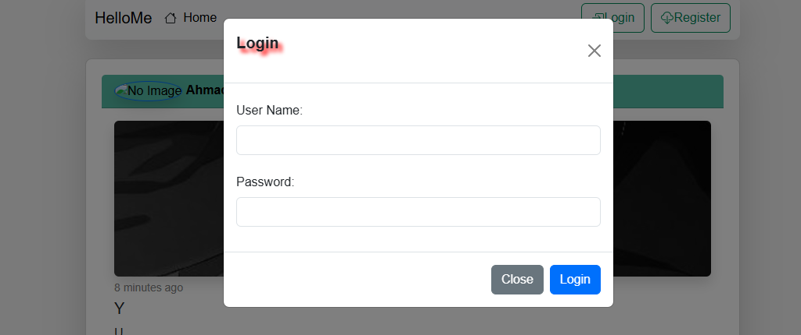
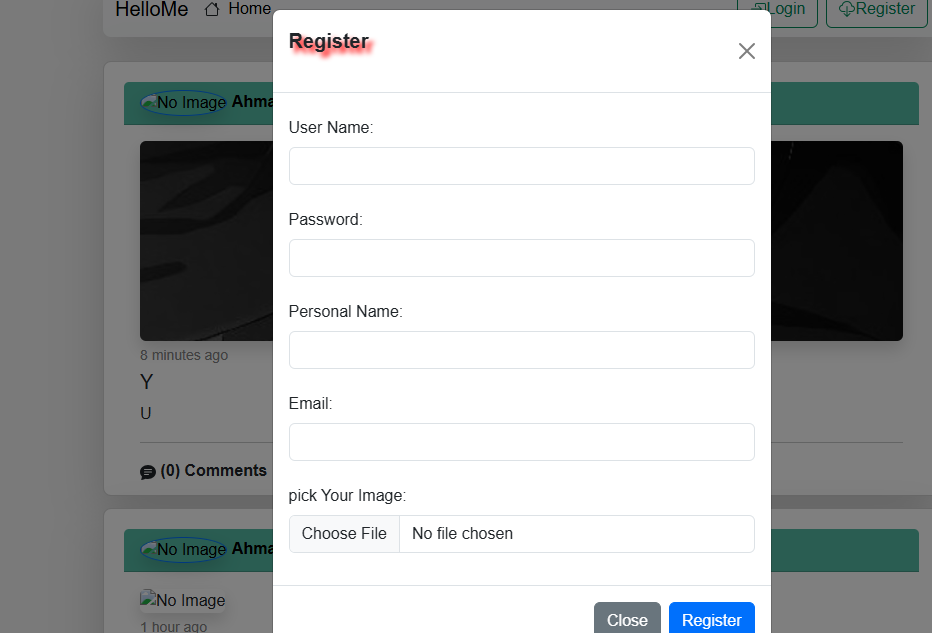
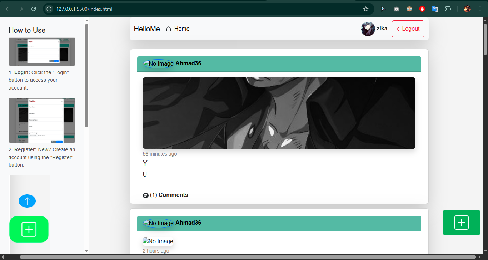

# 👥 SocialMediaApp

A fully functional **Social Media Frontend Web Application** built with **Vanilla JavaScript**, **Bootstrap**, and **HTML/CSS**.  
This project was developed as part of my advanced JavaScript training. It consumes a ready-made **RESTful API** built with **PHP Laravel** and **MySQL**, provided by *Yarob Al Mostafa* (instructor). The backend code is not included in this repository.

---

## 🔗 Live Demo / Repository

> [👉 Click here to view the project on GitHub](https://zakadev22.github.io/SocialMediaApp/)

---

## 📸 Features

- 🔐 **Authentication**  
  Register and login using JWT tokens stored in localStorage (via API).

- 👤 **Profile Management**  
  Display user profile image and name in the navbar dynamically.

- 📝 **Post Management (CRUD)**  
  Create, Read, Update, and Delete posts through API calls.

- 💬 **Comment System**  
  Add comments to posts with proper auth checks.

- 📷 **Image Uploads**  
  Upload images for user profiles and posts.

- 🧭 **Dynamic UI Behavior**  
  Toggle UI elements like nav links and buttons based on auth state.

- 🧩 **Sidebar Navigation**  
  Sidebar on the home page showing usage steps and guidance.

- 📄 **Pagination**  
  Posts are paginated using backend response data for smooth browsing.

- 🧪 **Postman for API Testing**  
  Used Postman to understand and test all backend API endpoints during development.

- 🎨 **Modern UI Design**  
  Built with **Bootstrap 5** and custom CSS animations for a clean experience.

- 📦 **Modular Codebase**  
  Organized using ES6 modules and structured JavaScript components.

---

## 🧪 Tech Stack

### 🔧 Frontend
- HTML5, CSS3, Bootstrap 5
- JavaScript (Vanilla + ES6 Modules)
- Axios (for API requests)
- Bootstrap Icons

### ⚙️ Backend *(Provided by Yarob Al Mostafa)*
- PHP Laravel
- MySQL
- RESTful API with JWT Auth

> Note: The backend source code is not part of this repository. API endpoints were provided as part of the course for frontend integration.

---

## 🖼️ Screenshots

> Replace these image links with your actual images

*Login Page with JWT Authentication*

*register with image and user info*

*Home Page showing posts and sidebar navigation*

---

## 🧭 Getting Started

1. Clone this repository
2. Open the `index.html` file using Live Server or your preferred method
3. Ensure you are connected to the valid API endpoints provided in the JS course
4. **https://documenter.getpostman.com/view/4696539/2s83zjqN3F**
5. Use Postman (optional) to inspect and test the API responses

---

## 🤝 Author

- **Frontend Developer**: [Zakaria Elfakhar](https://github.com/ZakariaElfakhar)  
- **Backend API Provider**: [Yarob Al Mostafa](https://mostafa.hashhackers.com/) *(Instructor, JS Course)*

---

